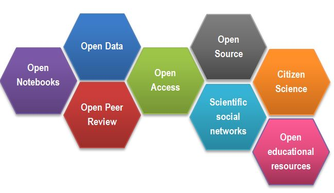
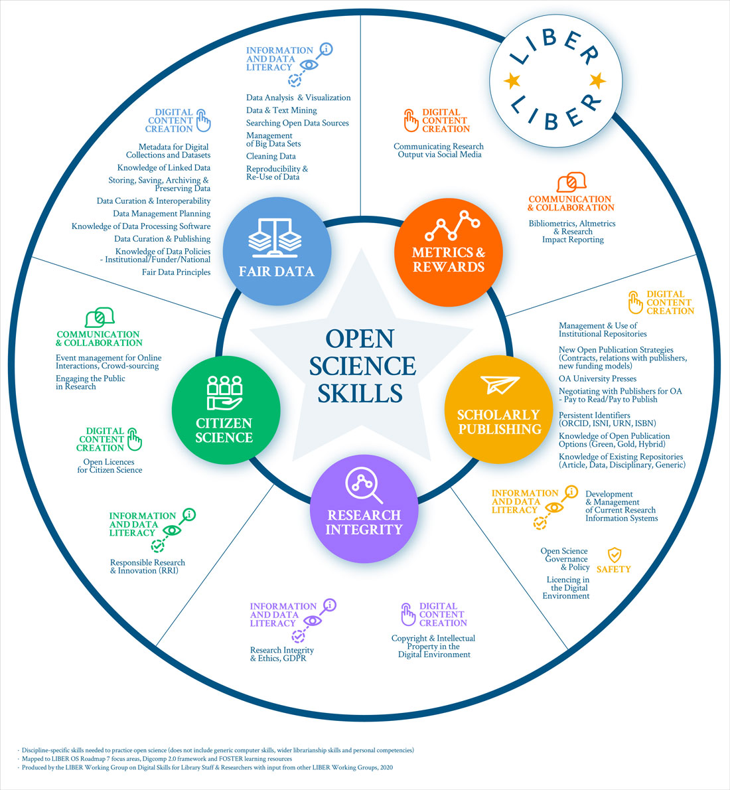
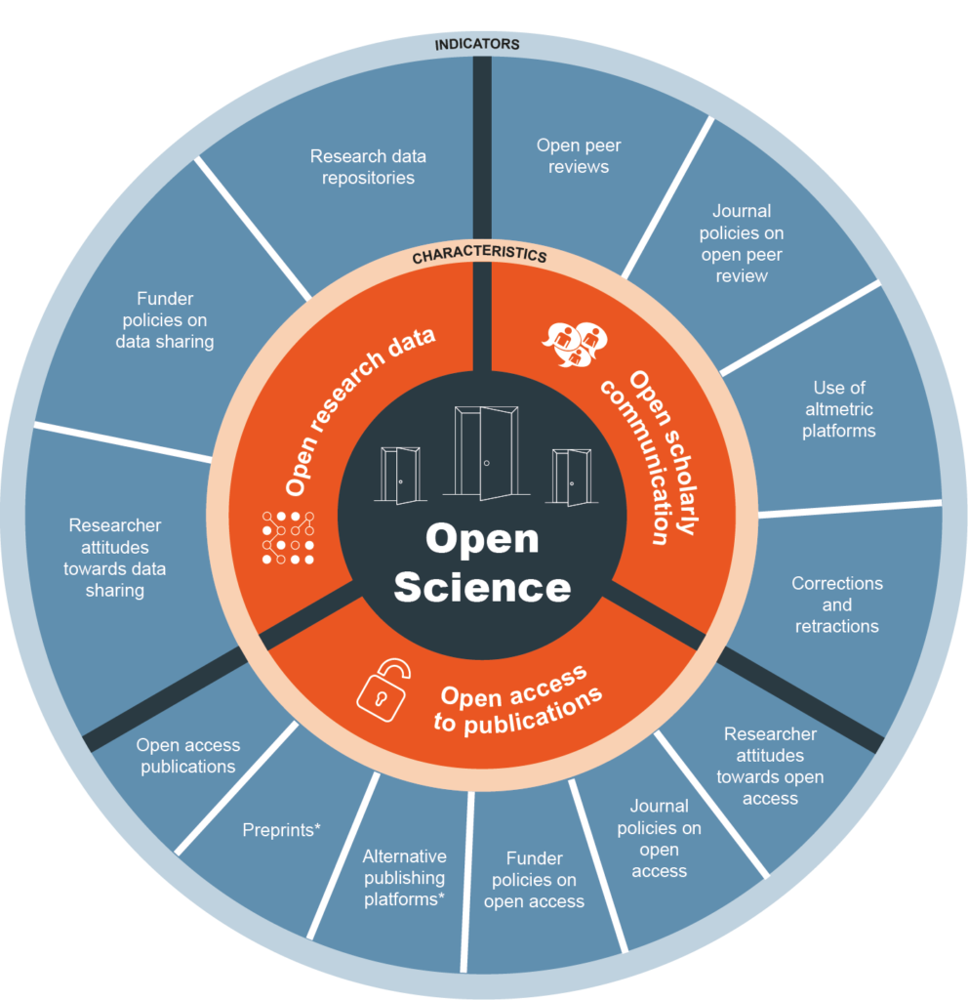
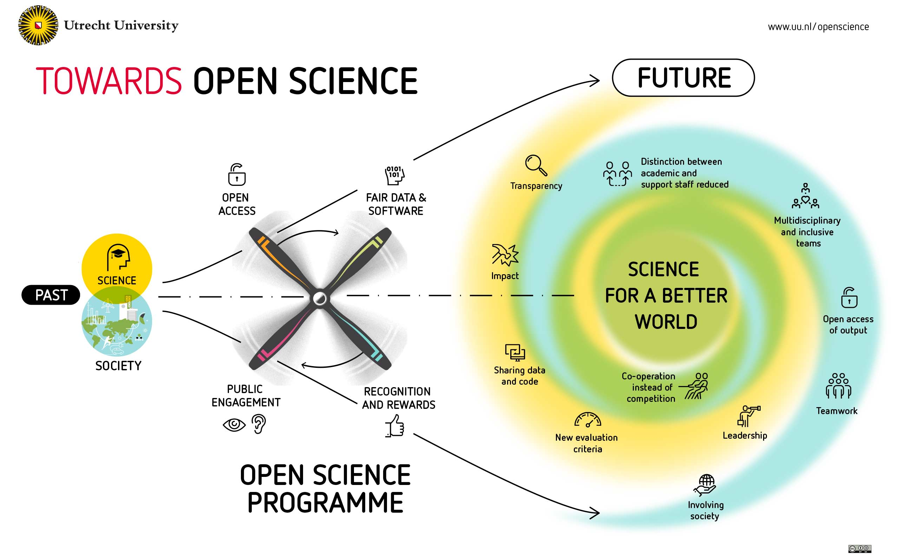
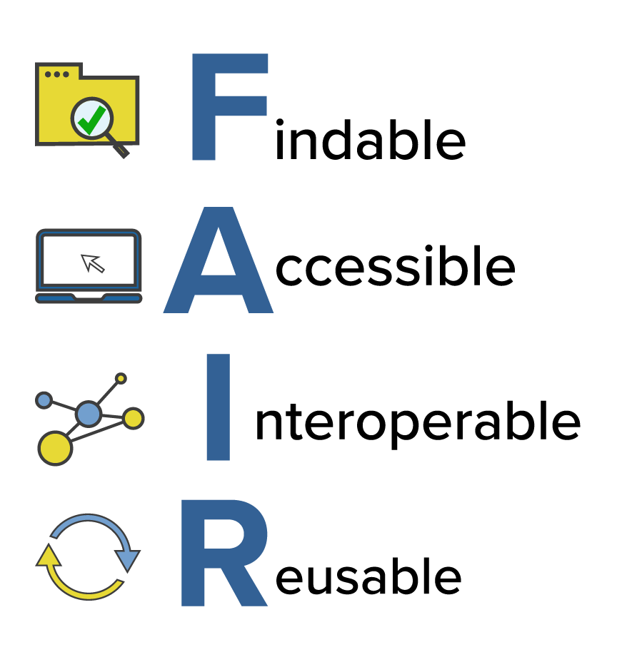
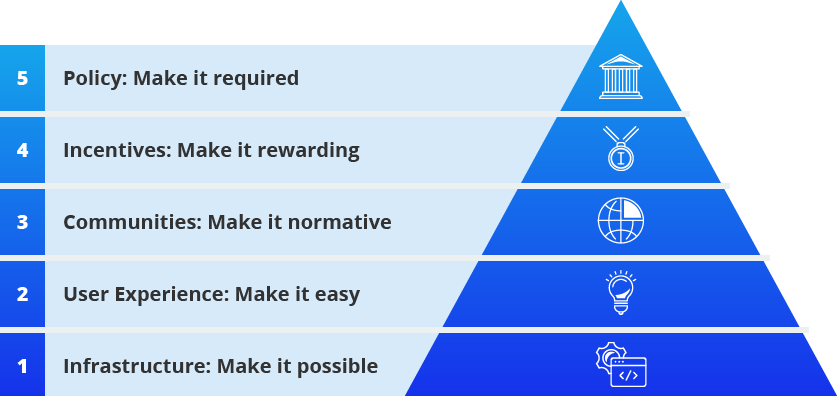

```{r, include=FALSE}
url <- "https://scienceverse.github.io/talks/2025-fdsai-ethics/"
subtitle <- sprintf("[%s](%s)", url, url)
# make QR code
qrcode::qr_code(url) |> qrcode::generate_svg("images/qrcode.svg")
```
---
title: "Papercheck"
subtitle: "`r subtitle`"
author: "Lisa DeBruine \n\n {width=300}"
format: 
  revealjs:
    logo: images/papercheck.png
    theme: [default, style.scss]
    transition: none
    transition-speed: fast
---

# Abstract

```{r, include = FALSE}
library(papercheck)
library(tidyverse)

theme_set(theme_minimal(13))

knitr::opts_chunk$set(echo = TRUE)
```

::: {style="font-size: smaller"}
Papercheck is a tool that leverages text search, code, and large language models to extract and supplement information from scientific documents (including manuscripts, submitted or published articles, or preregistration documents) and provides automated suggestions for improvement. 
 
Inspired by practices in software development, where automated checks (e.g., CRAN checks for R packages) are used to identify issues before release, Papercheck aims to screen scientific manuscripts to identify potential issues or areas for improvement and guide researchers in adopting best practices. It can also assist with processing large numbers of papers for metascientific enquiry.
:::

# The Problem

## Best Practices are Rapidly Evolving

::: {.notes}
- share data, code, and materials
- correctly apply statistical methods
- declare conflicts of interests 
- transparent author contributions
- appropriately cite papers; acknowledge retractions
- avoid overclaiming and inappropriate use of causal language
:::

::: {layout="[[2,1,1], [1,2,1]]"}











:::


## Un-FAIR Meta-Data

:::: columns
::: {.column width="30%"}

::: {layout="[[1], [1]]"}



:::

:::
::: {.column width="70%"}

- All research outputs should be FAIR
- PDFs are where data goes to die
- Meta-data use cases:
    - facilitating meta-analyses
    - improving the re-use of reliable measures
    - meta-scientific research

:::
::::


# Solutions

## Checklists?

:::: columns
::: {.column width="50%"}

Reporting guidelines, such as [CONSORT](https://www.goodreports.org/reporting-checklists/consort/), [PRISMA](https://prisma.shinyapps.io/checklist/), and [JARS](https://apastyle.apa.org/jars) often provide extensive checklists.

<style>
.checklist li::before {
  background-image: url('images/checkbox.svg');
}
</style>

::: {.checklist}
- Time-consuming
- Requires expertise
- Can be vague
- Who checks the checklist?
:::

:::

::: {.column width="50%"}

::: {.panel-tabset}

### JARS-1


### 2


### 3


:::

:::
::::

## Automated Checks

::: {.checklist}
- Time-efficient
- Requires less expertise
- Reproducible
- Generates machine-readable metadata
:::

## Automation Strategies

[Grobid](grobid.readthedocs.io): A machine learning software for extracting structured information from scholarly documents

And then...

::: {layout="[[1,1,1]]"}


:::


# R Package


## Paper Import

```{r, eval = FALSE}
file <- "papers/debruine-fret.pdf"
xml <- pdf2grobid(file, 
                  consolidateCitations = TRUE, 
                  consolidateHeader = TRUE)
paper <- read(xml)
```

```{r, echo = FALSE}
paper <- read("papers/debruine-fret.xml")
paper
```


## Batch Import

```{r}
papers <- read("papers")
```

:::: columns
::: {.column width="25%"}
```{r, echo = FALSE}
papers[[1]]
```
:::
::: {.column width="25%"}
```{r, echo = FALSE}
papers[[2]]
```
:::
::: {.column width="25%"}
```{r, echo = FALSE}
papers[[3]]
```
:::
::: {.column width="25%"}
```{r, echo = FALSE}
papers[[4]]
```
:::
::::


## Text Search

```{r, eval = FALSE}
search_text(paper, "Canadian")
```
::: {.module}

```{r, echo = FALSE}
search_text(paper, "Canadian") |> knitr::kable()
```

:::

## Regex Text Search

```{r, eval = FALSE}
search_text(paper, "\\b\\S+\\s*=\\s*\\S+\\b", return = "match")
```

::: {.module}

```{r, echo = FALSE}
search_text(paper, "\\b\\S+\\s*=\\s*\\S+\\b", return = "match") |> head(10) |> knitr::kable()
```

:::

## LLM

```{r, eval = FALSE}
query <- 'How many subjects were in the studies in total? 
Return your answer in JSON format giving the total and 
any subgroupings by gender, e.g.:
{"total": 100, men": 42, "women": 58}, 
Only return valid JSON, no notes.'

llm_subjects <- papers |> 
  search_text("\\d+", section = "method") |>
  search_text(return = "section") |>
  llm(query)

llm_subjects |> json_expand()
```

::: {.module}

```{r, echo = FALSE}

# llm_subjects[, c("id", "answer")] |> json_expand() |> dput()

data.frame(
  id = c("debruine-child", "debruine-fret", 
         "debruine-sex", "debruine-tnl"), 
  answer = c(
    "{\"total\": 71, \"men\": 32, \"women\": 39}", 
    "{\"total\": 48, \"men\": 24, \"women\": 24}", 
    "{\"total\": 136, \"men\": 86, \"women\": 50}", 
    "{\"total\": 144, \"men\": 66, \"women\": 78}"), 
  total = c(71L, 48L, 136L, 144L), 
  men = c(32L, 24L, 86L, 66L), 
  women = c(39L, 24L, 50L, 78L)
) |> knitr::kable()
```

:::


## Modules

```{r}
module_list()
```

## Modules: Effect Sizes

::: {.notes}
A JARS guideline that can be automatically checked is whether people report effect sizes alongside their test result. Each test, like a t-test or F-test, should include the corresponding effect size, like a Cohen’s d, or partial eta-squared. Based on a text search that uses regular expressions (regex), we can identify t-tests and F-tests that are not followed by an effect size, and warn researchers accordingly.
:::

```{r}
mod <- module_run(
  paper = psychsci,
  module = "effect_size"
)
```

::: {.module}

```{r, echo = FALSE}
mod$summary |> head(10) |> knitr::kable()
```
:::

## Modules:: Power Module

```{r, eval = FALSE}
mod <- module_run(
  paper = psychsci,
  module = "power"
)
```


## Select relevant text

``` r
sample_llm <- paper |>
  search_text(
    pattern = "power",
    section = "method", 
    return = "paragraph"
  ) |> 
  search_text(
    pattern = "[0-9], 
    return = "paragraph"
  ) |> 
  distinct(id, .keep_all = TRUE)
```

## LLM Instructions

An a priori power analysis is used to estimate the required sample size to achieve a desired level of statistical power given an effect size, statistical test and alpha level.

If the paragraph DOES describe an a priori power analysis, extract ONLY the following information and return it as JSON, use this exact schema:

```
{
  "apriori": true,
  "test": "one-way ANOVA",
  "sample": 64,
  "alpha": 0.05,
  "power": 0.8,
  "es": 0.4,
  "es_metric": "Cohen\'s f"
}
```

## LLMs Need Specific Rules

- Return "apriori": false if this is NOT an a priori power analysis, true if it is.
- Do NOT classify paragraphs as a priori if they only report achieved power for an existing sample size. 
- If information is missing or unclear, leave it empty. 
- Use only the exact labels listed for "test" and "es_metric".

## Rules

- For "test": Use ONLY these exact strings (case-sensitive). Choose the closest match or null if unclear/unsupported. Ignore one-sided vs. two-sided.

::: {.smaller}
    - "paired t-test"
    - "unpaired t-test"
    - "one-sample t-test"
    - "one-way ANOVA"
    - "two-way ANOVA"
    - "MANOVA"
    - "regression"
    - "chi-square"
    - "correlation"
    - "other"
    - null (if no test mentioned or unclear)
:::
    
## Rules

- For "es_metric": Use ONLY these exact strings (case-sensitive) or "unstandardised" for raw/non-standardized effects (e.g., means, proportions). Use null if missing/unclear.

::: {.smaller}
    - "Cohen\'s d"
    - "Hedges\' g"
    - "Cohen\'s f"
    - "partial eta squared"
    - "eta squared"
    - "unstandardised"
    - null
::: 

- Do NOT guess values. 
- Ignore whether the test is one-sided or two-sided. 
- If ANOVA is used, specify one-way or two-way. 

Return only valid JSON format, starting with { and ending with }.

## Results

::: {.module}

```{r}
#| echo: false
structure(list(test = c("", "", "unpaired t-test", "", "", "one-way ANOVA", 
"", "", "two-way ANOVA", ""), sample = c(12L, 16L, 24L, NA, 15L, 
24L, 10L, 15L, NA, 52L), alpha = c(0.05, 0.05, 0.05, NA, NA, 
0.05, 0.05, NA, 0.05, 0.05), power = c(0.95, 0.8, 0.8, NA, 0.9, 
0.8, 0.95, 0.8, 0.8, 0.8), es = c(1.15, 0.76, 0.6, 1.1, 0.25, 
NA, 1.36, 0.4, NA, 0.4), es_metric = c("unstandardised", "", 
"unstandardised", "Cohen's d", "Cohen's d", "", "", "Cohen's d", 
"", "unstandardised")), row.names = c("2", "3", "4", "5", "7", 
"8", "10", "11", "12", "13"), class = c("ppchk_llm", "data.frame"
)) |> knitr::kable()
```

:::

# Promoting Adoption




## Caveats

:::: {.columns}

::: {.column width="30%"}

<!-- icon credit WEBTECHOPS LLP -->


:::
::: {.column width="70%"}

* Validation
* Sustainability
* AI Reproducibility
* Inappropriate Use

:::
::::

# Thank You!

{width=120 style="vertical-align:middle;"} [papercheck](https://scienceverse.github.io/papercheck/) - download the package or submit issues

{width=120 style="vertical-align:middle;"} [VeriSci](https://github.com/VeriSci/) - join a community to create or test modules

{width=120 style="vertical-align:middle;"} [@debruine](https://debruine.github.io) - see what else I'm up to

