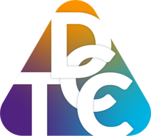
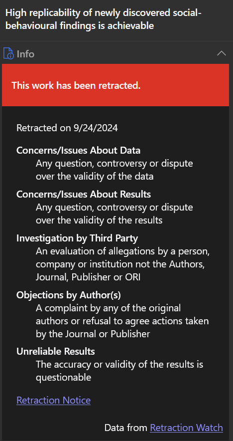
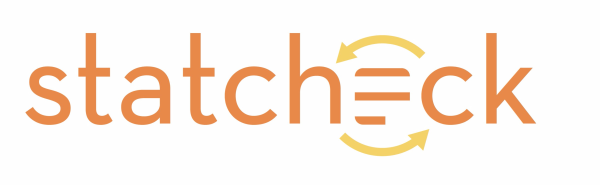
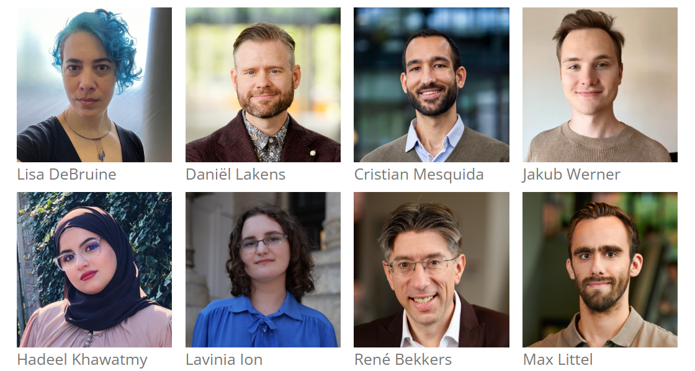
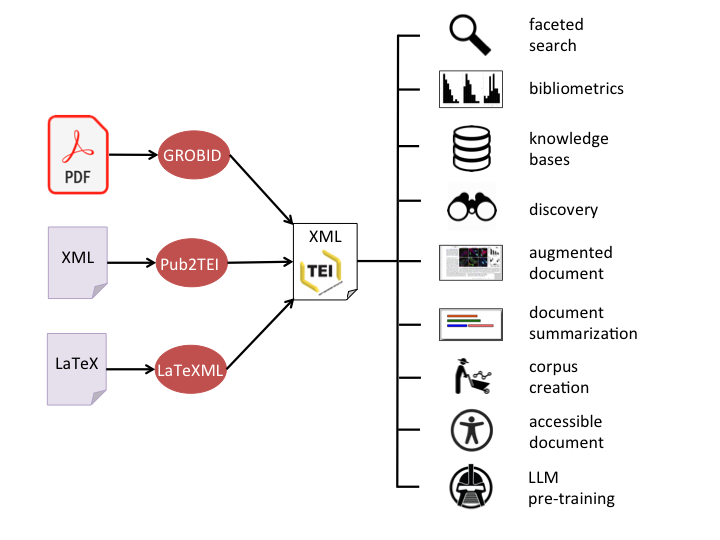
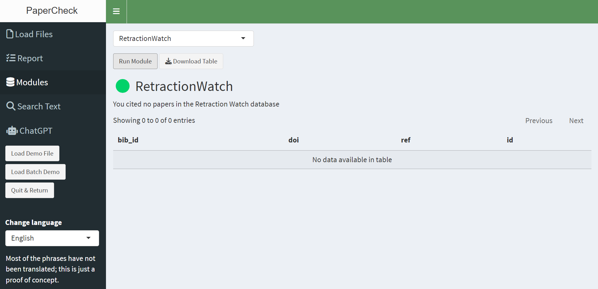
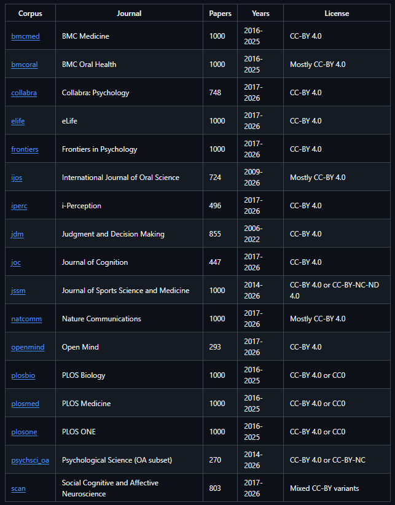
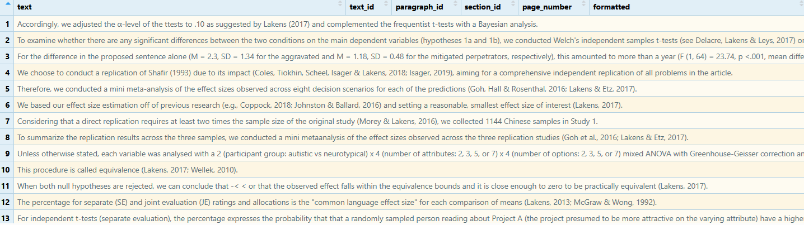

## Funding Acknowledgement {background-color="#ffffff"}

::: {style="display:flex; flex-direction:column; justify-content:space-between; height:85%;"}

Metacheck is partly financed by the Dutch Research Council (NWO) via VICI grant VI.C.241.013, the Thematic Digital Competence Centre Social Sciences & Humanities grant ICT.001.TDCC.018, and the Ammodo Science Award 2023 for the Social Sciences

::: {style="display:flex; justify-content:space-evenly; align-items:center;"}
{height="110px"}
{height="110px"}
{height="110px"}
:::

::: {.notes}
Load Rstudio and metacheck::report_app(port = 7775)
.
:::

:::

## Applying best practices {.top}

::: {.fragment .fade-up}
I've spent a decade writing papers on how people should improve their research practices.
:::

::: {.fragment .fade-up}
::: {.callout}
**Amazingly, there are people who have not read all my papers.** 😉
:::

::: {.fragment .fade-up}
We are all busy, and our memory is limited: I am starting to forget my own advice about best practices from 10 years ago.
:::

:::

## A Human Factors Perspective

::: {.fragment .fade-in}
In **Human Factors** research, there are the ISO‑9001 standards for quality management systems.
:::

::: {.fragment .fade-in}
Organizations should:

::: {.incremental}
- establish quality objectives
- plan to achieve them by securing the resources required — support staff, infrastructure
- provide an adequate social, psychological, and physical environment
:::
:::

## How can we get people to raise the bar?

::: {style="display:flex; justify-content:center; align-items:center; height:60%;"}
::: {.fragment .fade-up .reveal-anim-pulse style="font-size:1.4em; color:#c81919; font-weight:700;"}
we can rely on **automation**
:::
:::

## An example: CRAN check 

::: {.fragment}
An example is **CRAN check** — an automated tool that checks for common mistakes when people submit R packages.
:::

::: {.fragment .fade-up}
::: {.callout .green}
If it works for software packages, why not for scientific manuscripts?
:::
:::

## Tools that perform Automated Checks

There are already a number of tools that perform automated checks on scientific manuscripts.

## Zotero

Zotero automatically checks whether you cite a **retracted article**.

{height="380px"}

## Statcheck


{height="120px"}

Statcheck by Michelle Nuijten and Sascha Epskamp automatically recomputes reported *p*-values from the test statistics in a paper.


::: {.fragment .fade-up}
::: {.callout .green}
Statcheck is already incorporated into Metacheck!
:::
:::

## RegCheck

{height="120px"}

RegCheck by Jamie Cummins automatically compares preregistrations against the paper.

::: {.fragment .fade-up}
::: {.callout .green}
The metacheck module that incorporates RegCheck is done. It also works locally! 
:::
:::

## Enter Metacheck {.center}

::: {.fragment .fade-up}
We are building a **module-based tool** to automate checks for anything we can.
:::

::: {.fragment .fade-up}
{height="260px"}
:::

## Built for everyone {.center}

:::: {.columns}

::: {.column width="33%"}
::: {.fragment .fade-up}
#### 🧩 Open
It's an **R package**. Anyone can add modules — checks for different fields.
:::
:::

::: {.column width="33%"}
::: {.fragment .fade-up}
#### 🛒 One-stop shop
All checks, one place, one report.
:::
:::

::: {.column width="33%"}
::: {.fragment .fade-up}
#### 🔁 Flexible
Run it yourself, or batch-check at scale.
:::
:::

::::

## Who is it for? {.center}

::: {.incremental}
- ✍️ **Authors**, before they submit
- 🔍 **Peer reviewers**, during review
- 📦 **Metascientists**, uploading PDFs in **batches** across whole literatures
:::

## Reading the paper

Metacheck reads in a PDF using **GROBID**. But Jakub Werner is also building **bibr**.

:::: {.columns}

::: {.column width="70%"}
{height="420px"}
:::

::: {.column width="30%"}
{height="160px"}
:::

::::

## {background-iframe="http://127.0.0.1:7775" background-interactive="true"}

::: {.notes}
Before presenting, start the app in RStudio with: metacheck::report_app(port = 7775)
The running app is embedded live on this slide via background-iframe — click into it normally to demo.
:::


## Reusing what already exists

We don't need to reinvent every check — we can **build in existing tools**.

::: {.fragment .fade-up}
{height="440px"}
:::

## The module ecosystem so far {.center}

::: {.module-grid}
::: {.module-card .fragment}
<span class="icon">🚫</span>**Flag citations**. Incoherent, or to retracted or replicated papers
:::
::: {.module-card .fragment}
<span class="icon">🔢</span>**Statcheck**<br>recompute & verify *p*-values
:::
::: {.module-card .fragment}
<span class="icon">🗣️</span>**Marginal significance**<br>flag wrong-interpretation language
:::
::: {.module-card .fragment}
<span class="icon">📋</span>**Peregistration**<br>Retrieve preregistration content
:::
::: {.module-card .fragment}
<span class="icon">📐</span>**Effect size**<br>check for effect sizes & recompute them
:::
::: {.module-card .fragment}
<span class="icon">⚡</span>**Power**<br>check correctly reported power analyses
:::
::: {.module-card .fragment}
<span class="icon">📁</span>**Repo-check**<br>check repositories for a README & more
:::
::: {.module-card .fragment}
<span class="icon">💻</span>**Code-check**<br>flag absolute paths & files missing from repo
:::
:::

## New Features: Ethics check

Researchers who collect data should indicate if they received ethics approval. 
We check for live data collection, and an ethics statement. 

::: {.fragment}
::: {.callout}
In Eindhoven we are working on making meta-data for all ethics approvals public.
:::
:::

## Upcoming features: Data check

Check data repositories, load data files, check if data is FAIR and well documented. 

::: {.fragment}
::: {.callout}
Building on the work of Levi Baruch, who is going to defend his master thesis soon. 
:::
:::

## Upcoming features: Miscitation database

Researchers can log their own papers (or papers by others) that are commonly miscited. 

::: {.fragment}
::: {.callout}
5% of citations is outright incorrect, another 5% leaves out important details. Building on the work of Mink Veltman, who is also going to defend his master thesis soon. 
:::
:::


## Paper Databases

:::: {.columns}

::: {.column width="50%"}
We have made open access papers available from 18 open access journals with more than 15.000 papers (as well as instructions to download other papers).
:::

::: {.column width="50%"}
{height="600px"}
:::

::::

## Paper Databases

A growing resource of open access papers.

```r
jdm <- papers_load("jdm")
search_res <- search_text(jdm, "Lakens", return = "sentence")
```
::: {.fragment .fade-up}

:::


## Privacy and LLM use

::: {.fragment .fade-up}
Use of LLMs is always optional. All modules can be run without connecting to the internet.
:::

::: {.fragment .fade-up}
A local Ollama installation can run the power module of RegCheck (or retrieve info from papers for you) 
:::
 

## Imperfect detection is still useful {.center}

::: {.fragment .fade-up}
The goal is **not** to detect everything perfectly. Like a spelling checker, the goal is to detect enough accurately so the tool overall is useful. 
:::

::: {.fragment .fade-up}

::: {.callout .left}
We will need to educate users about how tools work (they expect perfect accuracy, but checking a data repository is more difficult than checking a word, and your spelling check is wrong a lot!)
:::

:::


## Get involved {.center background-color="#fbeaea"}

::: {.fragment .fade-up}
We are happy to work with you if you want to use **Metacheck**:
:::

:::: {.columns}
::: {.column width="50%"}
::: {.fragment .fade-up}
### 🔬 for **meta-science**
running checks at scale across a literature
:::
:::
::: {.column width="50%"}
::: {.fragment .fade-up}
### 🧱 to **build a module**
ceate checks useful for your field
:::
:::
::::

# Workshop: Following the Manual {.center background-color="#fbeaea"}

::: {.fragment .fade-up}
We will now work through **The Metacheck Manual** together, with **live, runnable code**.
:::

::: {.fragment .fade-up}
::: {.callout .left}
Open RStudio and follow along: <https://scienceverse.github.io/metacheck_book/>
:::
:::

::: {.notes}
This is the hands-on part. Have RStudio open. Each chapter of the manual gets at most 3 slides. We skip "creating modules" — that is for module developers.
:::

# Part I — Getting Started {background-color="#fbeaea"}

## Setting up Metacheck {.smaller}

Install from GitHub with `pak` (or the `dev` branch for the newest modules):

```r
pak::pkg_install("scienceverse/metacheck")
# development version (newer modules, more bugs):
pak::pkg_install("scienceverse/metacheck@dev")
```

```r
library(metacheck)
```

::: {.fragment .fade-up}
::: {.callout .green}
The easiest way to start: launch the Shiny app, upload a PDF, get a report.
:::
:::

## The Shiny report app {.smaller}

```r
metacheck::report_app()
```

::: {.incremental}
- Upload a local PDF → automatic report from all **validated modules**
- Each module: summary, detailed feedback, how it works, how it was validated
- Controls what is sent to / retrieved from external servers
- Gives you the **R code** to move into R for the full feature set
:::

::: {.notes}
Demo: this is the same app embedded earlier on the live slide. Walk through summary → a single module → "how it works" → "validation".
:::

## Running locally for privacy {.smaller}

Metacheck can run **fully offline** — nothing leaves your machine. Useful for editors / reviewers handling unpublished manuscripts.

- PDF → text uses a **GROBID** server. By default a GDPR-compliant server at TU Eindhoven.
- Run your own GROBID locally with Docker:

```bash
docker run --rm --init --ulimit core=0 -p 8070:8070 lfoppiano/grobid:0.9.0
```

::: {.fragment .fade-up}
A detected local GROBID server is used automatically. The same idea applies to LLMs (run locally with Ollama).
:::

## Reading in a paper {.smaller}

Step 1 is always: turn a PDF into a paper object. `convert()` does PDF → JSON (once), `read()` loads it.

```r
pdf_file  <- demofile("pdf")
json_file <- convert(pdf_file, save_path = "converted",
                     crossref_lookup = TRUE)   # enrich references from CrossRef

paper <- read(json_file)        # also reads GROBID XML directly
```

::: {.fragment .fade-up}
Point at a **local** GROBID server with `api_url = "http://localhost:8070"`.
:::

## The paper object {.smaller}

`read()` returns a structured `scivrs_paper` — a list of tables. Everything operates on this.

```r
class(paper)
names(paper)
paper$info$title
paper$info$doi
```

:::: {.columns}
::: {.column width="50%"}
- `info` — paper-level metadata
- `author` — one row per author
- `text` — one row per **sentence**
- `section` — headings + section type
- `url` — links in the text
:::
::: {.column width="50%"}
- `bib` — the reference list
- `xref` — citation cross-references
- `figure` / `table` — figures & tables
- `eq` — extracted statistics
- `bib_match` — CrossRef matches
:::
::::

## Batch processing {.smaller}

`convert()` and `read()` also take a **folder** or a vector of paths → a list of paper objects (a *paperlist*).

```r
# pull one component from every paper into one table
paper_table(psychsci[1:5], "info", c("title", "doi"))
```

::: {.fragment .fade-up}
Most functions and **every module** accept a single paper *or* a paperlist — the same code scales from one paper to a whole corpus.
:::

::: {.notes}
psychsci = 250 open-access Psychological Science articles, bundled with the package.
:::

## Text search {.smaller}

One core operation underlies most modules: search a paper's text for matching sentences.

```r
paper <- read(demofile("json"))

text_search(paper)                        # every sentence, with metadata
text_search(paper, pattern = "metacheck") # regex by default; fixed = TRUE for literal
text_search(paper, "GitHub", return = "paragraph")  # sentence|paragraph|section|match
```

::: {.fragment .fade-up}
Expand context around hits with `text_search(paper, "metacheck") |> text_expand(paper, plus = 1, minus = 1)`.
:::

## Refining a search across a corpus {.smaller}

Develop patterns **iteratively**: start broad, inspect, tighten.

```r
text_search(psychsci, "power analysis")          # precise, misses some
text_search(psychsci, "power")                   # broad, catches "powerful", "PowerPoint"

# negative lookahead drops the false positives (needs perl = TRUE)
text_search(psychsci, "power(?!ful|point)", perl = TRUE, ignore.case = TRUE)
```

::: {.fragment .fade-up}
Use `anti_join()` to see what you **excluded**, and `count(..., sort = TRUE)` to spot outlier papers using a term in another sense.
:::

::: {.notes}
This iterative search is the foundation for writing your own module — which we are skipping today, but this is where it starts.
:::

## Using Large Language Models {.smaller}

Most of Metacheck needs **no AI**. A few modules (power, prereg/reg-check) can do *more* with an LLM — and you can query papers directly.

```r
llm_use(TRUE)                       # off by default — opt-in
llm_model("ollama/qwen3.5:9b")      # local (recommended), or "groq", "openai", ...
llm_model_list("ollama")            # what's available
```

::: {.callout .left}
**Philosophy:** LLMs only *classify existing text*, never judge quality. Recommended setup runs **locally** so no data leaves your machine.
:::

## Querying papers with `llm()` {.smaller}

Narrow the text with `text_search()` first, then ask a question — fewer, cheaper, faster queries.

```r
generaliz <- text_search(psychsci[["09567976231222836"]], "generaliz",
                         ignore.case = TRUE)

llm(generaliz,
    "Do the authors state constraints on generalizability? Answer TRUE or FALSE.")
```

::: {.fragment .fade-up}
Add an ellmer `type` spec (or ask for JSON) for **structured output**, then `json_expand()` it into columns. A cap (`llm_max_calls()`, default 30) guards against runaway costs.
:::

## Paper database corpora {.smaller}

Pre-built corpora of open-access papers, already converted — for validating and comparing modules.

```r
papers_available()                 # list published corpora + sizes
jdm <- papers_load("jdm", cache = TRUE)   # download (and keep) a corpus
papers_metadata("jdm")             # Dublin Core provenance
```

::: {.fragment .fade-up}
Run fast, offline modules straight across a corpus:

```r
module_run(jdm[1:20], "stat_check")$summary_text
```
:::

::: {.notes}
18 open-access journals, 15,000+ papers. Key point: validate modules across literatures — Statcheck only finds APA-style stats, common in psychology, rare in medicine.
:::

# Part II — Modules {background-color="#fbeaea"}

## How every module runs {.smaller}

One verb: `module_run(paper, "module_name")`. Returns a list with a `traffic_light`, `summary_text`, and a `table`.

```r
paper <- demopaper()
mo <- module_run(paper, "power")
mo$traffic_light    # "green" | "yellow" | "red" | "na"
mo$summary_text
mo$table
```

::: {.fragment .fade-up}
::: {.callout .left}
Output is a **prompt for human judgement**, never a verdict. Treat flags as "look here".
:::
:::

## Power analysis {.smaller}

Finds power-analysis sentences and classifies them *a priori* / *sensitivity* / *post-hoc* (regex only).

```r
mo <- module_run(demopaper(), "power")
mo$table[, c("text", "power_type", "complete")]
```

::: {.fragment .fade-up}
Turn on an LLM to **extract structured details** — test, sample size, alpha, power, effect size:

```r
llm_use(TRUE); llm_model("ollama/qwen3.5:9b")
module_run(demopaper(), "power")
```
:::

::: {.notes}
Validation: 246 power statements, 90.6% positive predictive value. Local vs cloud model trade-off: recall vs precision, speed vs privacy.
:::

## Preregistration check {.smaller}

Finds OSF / AsPredicted links, retrieves the preregistration, and organises it into one standardised template — easy to compare against the paper.

```r
mo <- module_run(demopaper(), "prereg_check")
mo$table[, c("template_name", "title", "id", "sample_size")]
names(mo$table)   # design, hypotheses, stopping rule, tests, exclusions, ...
```

::: {.callout .left}
Makes **live network calls** to OSF / AsPredicted. Cannot read unstructured templates or uploaded-document preregistrations.
:::

## RegCheck: compare paper vs prereg {.smaller}

`reg_check` goes further — an LLM judges, dimension by dimension, whether the paper **deviates** / is **consistent** / has **insufficient info**.

```r
demopaper() |>
  module_run("prereg_check") |>
  module_run("reg_check", client = "groq")   # or "ollama" to run fully local
```

::: {.fragment .fade-up}
The `deviation_information` column quotes both documents — it points a reviewer to the exact sentences. Needs `REGCHECK_API_TOKEN`; one LLM call per dimension (slow).
:::

## Ethics approval check {.smaller}

Searches for an **ethics approval** statement (IRB, REC, IACUC, Helsinki, waivers…), across many phrasings and languages. Fully **offline**.

```r
mo <- module_run(psychsci[1:10], "ethics_check")
mo$summary_table[, c("paper_id", "ethics_approved")]
```

::: {.fragment .fade-up}
Only flags a *missing* statement when the paper looks like it involved **live data collection** — so re-analyses and simulations are not penalised (`needs_ethics`).
:::

## Marginal significance {.smaller}

Lists sentences that dress up a non-significant result: "marginally significant", "approaching significance", "trending toward"… Fully **offline**.

```r
mo <- module_run(demopaper(), "marginal")
mo$table[, c("text", "section_type")]
```

::: {.fragment .fade-up}
Six families of phrasing (one regex). Validation: 63% PPV, misses ~42% — a **first-pass highlighter** for human review, based on Hankins' catalogue.
:::

## Statistical reporting modules {.smaller}

Four fast, **offline** checks on reported statistics:

| Module | Flags |
|---|---|
| `stat_check` | p-value inconsistent with the test statistic (Statcheck; t & F tests, APA format) |
| `stat_p_exact` | imprecise p-values (`p < .05`) and impossible `p = .000` |
| `stat_p_nonsig` | non-significant p-values, to check they aren't read as "no effect" |
| `stat_effect_size` | t / F tests reported without an effect size |

```r
module_run(demopaper(), "stat_check")$table[, c("reported_p", "computed_p", "error", "decision_error")]
```

::: {.notes}
Watch decision_error == TRUE: reported vs recomputed p fall on opposite sides of .05. Statcheck by Nuijten & Epskamp; only validated for t and F tests.
:::

## Repository check {.smaller}

Finds repository links (OSF, GitHub, ResearchBox, Zenodo), lists the files, and reports what was shared. **Live network calls.**

```r
mo <- module_run(demopaper(), "repo_check")
mo$table[, c("repo_name", "file_name", "file_type", "file_size")]
```

::: {.incremental}
- **green** — README present, no archives, in every repo
- **yellow** — a repo missing a README, or a `.zip` whose contents can't be inspected
- **na** — no repository links found
:::

## Code check {.smaller}

Reads the actual code files `repo_check` finds (R, SAS, SPSS, Stata) and checks reproducibility.

```r
mo <- module_run(demopaper(), "code_check")
mo$table[, c("file_name", "language", "parse_error",
             "absolute_paths", "loaded_files_missing")]
```

::: {.fragment .fade-up}
Flags: **absolute paths** (`C:/Users/me/...`), **missing loaded files**, parse errors, scattered `library()` calls. `file_limit` caps how many files (default 20).
:::

## Reference checks {.smaller}

Three modules cross-reference the paper's **citations** against external databases (all need internet):

::: {.incremental}
- `ref_retraction` — cited papers in the **Retraction Watch** database (`rw_update()` to refresh)
- `ref_replication` — cited originals with a recorded **replication** in FLoRA (`show_outcomes = TRUE`)
- `ref_pubpeer` — cited papers with **PubPeer** comments (Statcheck comments ignored)
:::

```r
module_run(demopaper(), "ref_retraction")$table[, c("doi", "text")]
module_run(demopaper(), "ref_replication", show_outcomes = TRUE)$table
module_run(demopaper(), "ref_pubpeer")$table
```

::: {.notes}
A flag is never automatically "bad" — a retracted paper can be cited to discuss the retraction; a replication invites you to recheck how you cite the original. Awareness, then judgement.
:::

# Part III — Using Metacheck Locally {background-color="#fbeaea"}

## Checking local files {.smaller}

`repo_check` / `code_check` can point at a **local folder** instead of an online repo — your own code, a reviewer's zip, or an unsupported service (GitLab, Figshare, Dataverse).

```r
# test_paper() = a minimal paper with no repo links, so only local files are checked
module_run(test_paper(), "repo_check", local_path = "C:/projects/my_study")
module_run(test_paper(), "code_check", local_path = "C:/projects/my_study")
```

::: {.callout .left}
On OneDrive / iCloud / Dropbox: choose **"Always keep on this device"** first, or every file download will be slow.
:::

## Local files: useful options {.smaller}

```r
# only local, skip all online lookups
module_run(test_paper(), "code_check", local_path = path, local_only = TRUE)

# raise the 20-file cap
module_run(test_paper(), "code_check", local_path = path, file_limit = Inf)

# download an OSF project (nested components) to a folder, then check it
osf_file_download(osf_id = "pngda", download_to = ".",
                  max_file_size = 1, max_download_size = 10)
```

::: {.fragment .fade-up}
Run as a two-step pipeline (`repo_check` → `code_check`) so slow cloud downloads happen **once**.
:::

## Local AI with Ollama {.smaller}

Run LLM modules with **no internet, no API key, no cost** — papers stay on your machine. The 9b model wants ~16 GB RAM; the smaller 3b runs in ~8 GB. No GPU required.

```bash
# 1. install from ollama.com/download, then pull a model:
ollama pull qwen3.5:9b      # ~6.6 GB; smaller qwen2.5:3b (~2 GB) works on lighter machines
```

```r
# 2. point Metacheck at it
llm_use(TRUE)
llm_model("ollama/qwen3.5:9b")
llm_max_calls(5000)         # free + local → set as high as you like
```

::: {.fragment .fade-up}
First query is slow (model loads into memory); later ones are fast. Verify at <http://localhost:11434>.
:::

## RegCheck, fully local {.smaller}

Run the prereg comparison on your own machine — no text leaves it. One-time server setup beside Ollama.

```bash
ollama pull nomic-embed-text-v2-moe
ollama pull llama3.2        # or a larger model for better judgements
```

```r
regcheck_start_local(method = "docker")   # first run builds the image (~5 min)
module_run(demopaper(), "reg_check")        # client = "ollama" by default → local
regcheck_stop_local()
```

# Get involved {.center background-color="#fbeaea"}

::: {.fragment .fade-up}
The manual continues with **writing your own module** and the full **function reference**:
:::

::: {.fragment .fade-up}
::: {.callout .green .left}
📖 <https://scienceverse.github.io/metacheck_book/><br>
📦 <https://scienceverse.github.io/metacheck/>
:::
:::

::: {.fragment .fade-up}
Reach out if you want to **build a module** for your field or run checks at **meta-scientific scale**.
:::

## Thank you! {.center background-color="#fbeaea"}

:::: {.columns}

::: {.column width="25%" style="text-align:center;"}
{height="200px"}

**Metacheck**
:::

::: {.column width="25%" style="text-align:center;"}
{height="200px"}

**Stats Textbook**
:::

::: {.column width="25%" style="text-align:center;"}
{height="200px"}

**Podcast**
:::

::: {.column width="25%" style="text-align:center;"}
{height="200px"}

**Graduate School**
:::

::::
