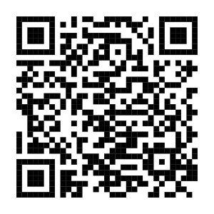

```{r, eval=FALSE}
url <- "https://scienceverse.org/talks/2026-forrt-ai-conf/#/title-slide"
subtitle <- sprintf("[%s](%s)", url, url)
# make QR code
qrcode::qr_code(url) |> qrcode::generate_svg("images/qrcode.svg")
```

---
title: "Improving the transparency of power analyses with Metacheck"
subtitle: "Cristian Mesquida"
author: "{width=300}"
format: 
  revealjs:
    logo: images/metacheck.png
    theme: [moon, style.scss]
    transition: none
    transition-speed: fast
    syntax-highlighting: zenburn
bibliography: references.bib
---

```{r packages, include = FALSE}
library(tidyverse)
library(flextable)
library(metacheck)
```

```{r defaults}
set_flextable_defaults(
  font.size = 20,
  padding.top = ,
  font.color = "white",
  border.color = "grey"
)
theme_set(theme_minimal(base_size = 17))
```

## Power

::: {style="font-size: 90%;"}
- **false positive rate**: the probability a <i class="st">test</i> concludes there is an <i class="es">effect</i> when there is no effect; Type I Error Rate
- <i class="a">alpha</i> : the false positive rate we accept for a <i class="st">test</i>
- **false negative rate**: the probability a <i class="st">test</i> concludes there is no <i class="es">effect</i> when there is one; Type II Error Rate
- **beta**: the false negative rate we accept for a test
- **true positive rate**: the probability a <i class="st">test</i> concludes there is an <i class="es">effect</i> when there is one
- <i class="power">power</i>: the true positive rate (1-beta), given a <i class="st">test</i>, <i class="es">effect</i>, <i class="ss">sample size</i>, and <i class="a">alpha</i>
:::

## Power analysis

Studies designed with high <i class="power">power</i> are more informative:

- Higher probability of detecting the effect size of interest when it exists (i.e., higher true positive rate)

- A non-significant result is more informative because it is less likely to be due to insufficient power. For example, a non-significant result from a study designed with <i class="power">90% power</i> is more informative than one from a study designed with <i class="power">50% power</i>

## Types of Power Analysis

:::: columns
::: {.column width="100%"}
- <i class="pt">**A Priori**</i>: calculates the required <i class="ss">sample size</i> to achieve a pre-specified <i class="power">power</i> given a pre-specified <i class="es">effect size</i>

- <i class="pt">**Sensitivity (Effect Size)**</i>: calculates the smallest <i class="es">effect size</i> required to detect a pre-specified <i class="ss">sample size</i> with a pre-specified <i class="power">power</i>

- <i class="pt">**Sensitivity (Power)**</i>: calculates <i class="power">power</i> given a pre-specified <i class="es">effect size</i> and <i class="ss">sample size</i>

- <i class="pt">**Post Hoc**</i>: calculates the <i class="power">power</i> associated with the observed <i class="es">effect size</i> and the <i class="ss">sample size</i> actually obtained
:::
::::

## Current issues in power analyses

- Mindlessly done [@schulz2005; @mesquida2025]
- Insufficient reporting [@mesquida2025; @bakker2020; @thibault_2024]

## Reporting

- <i class="pt">power type</i>: a priori, power/sample size sensitivity, post hoc
- <i class="power">power</i>: value between alpha and 100%
- <i class="ss">sample size</i>: number of subjects/items
- <i class="es">effect size</i>: numeric value
- <i class="esm">effect size metric</i>: e.g., Cohen's $d$, $r$, $\eta_{p}^{2}$, raw
- <i class="st">statistical test</i>: full specification
- <i class="a">alpha</i>: 0-1, often assumed to be 0.05
- <i class="sw">software</i>: e.g., G\*Power, Superpower, simulation

## 

How would you write up this power analysis?

```{r example}
#| echo: true

pwr::pwr.t.test(          
  power = 0.80,           
  d = 0.5,                
  sig.level = 0.01,       
  type = "two.sample",    
  alternative = "greater" 
)
```

## Model Reporting Example

> We conducted an <i class="pt">a priori analysis</i> to determine the sample size with <i class="power">80%</i> power to detect the smallest effect size of interest (SESOI), which was a <i class="esm">Cohen's d</i> of <i class="es">0.5</i> determined by a cost-benefit analysis of the intervention. We used the <i class="sw">pwr package (Champely, 2020)</i> for an <i class="st">independent samples t-test, assuming equal variance and using a one-tailed prediction</i>, with a critical alpha of <i class="a">0.01</i>. This determined that we would need <i class="ss">82</i> subjects in each group.

## The Reality

> A sample size of <i class="ss">22</i> participants was predetermined to yield a power of <i class="power">80%</i> and to detect an effect of comparable size to previous studies using similar independent and dependent measures (CITE).

## The Reality

> We decided to obtain a sample size that would allow us to detect a within-subjects difference of at least a medium effect size with <i class="power">80%</i> power, using a <i class="st">two-tailed t-test</i>. A power analysis using <i class="sw">G\*Power (Version 3.1.9.3; Faul et al., 2007)</i> indicated that this required a sample size of <i class="ss">34</i>.

## The solutions

::: {.fragment .fade-in-then-out}
- Develop reporting guidelines
- Increase awareness through better training
- Adherence to reporting guidelines
:::

::: {.fragment .fade-up}
- Automation
:::

## Metacheck

- It performs automated checks on **manuscripts** and **repositories**

::: {.fragment .fade-in-then-out}
- Manuscripts: `stat_effect_size`, `stat_p_nonsig`, `marginal`, `power`, etc.
:::

::: {.fragment .fade-up}
- Repositories: `repo_check`, `code_check`, `data_check`, etc.
:::

## Checking for power analysis

The `power` module can help researchers report all components of a power analysis.

```{r}
#| echo: TRUE
#| eval: FALSE

library(metacheck)
module_run(paper, "power")
```

## Regex-based approach

It detects the type of power analysis using regular expressions (i.e., regex) only

```{r run_and_display}
#| echo: TRUE
papers <- papers_load("psychsci")         # Load Psychological Science articles
llm_use(FALSE)                            # Set to FALSE by default
res <- module_run(papers[100], "power")   # Run the power module

res$table[, c(                            # Select relevant columns
  "section_type", 
  "power_type"
  )] |> 
  flextable()
```

## LLM-based approach

An LLM is used to identify and extract the reported components of the power analysis

```{r run_and_store}
#| echo: FALSE
#| eval: FALSE

papers <- papers_load("psychsci")         # Load a set of articles
llm_use(TRUE)                             # Set to TRUE to enable LLM
llm_model("ollama/qwen2.5:3b")                       # Specify LLM model
res <- module_run(papers[100], "power")   # Run the power module
saveRDS(res, "res.RDS")                   # Store for efficiency
```

```{r read}
#| echo: FALSE
#| eval: TRUE
res <- readRDS("res.RDS")
```

```{r}
#| echo: TRUE
#| eval: FALSE

llm_use(TRUE)                           # Set to TRUE to enable LLM
llm_model("ollama/qwen2.5:3b")          # Specify LLM model
res <- module_run(papers[110], "power") # Run the power module
```

```{r display}
#| echo: TRUE

res$summary_table |> 
  flextable()
```

## First match

```{r first_match}
#| echo: TRUE

# Select relevant columns
res$table[1, c("power_type", "statistical_test", "sample_size", "alpha_level", "power", "effect_size", "effect_size_metric", "software")] |> 
  flextable()
```

> \[...\], we used a conservative effect size (<i class="esm">d</i>) of <i class="es">0.5</i>, an alpha of <i class="a">.05</i>, and power of <i class="power">.8</i> for our sample-size computation (<i class="sw">G\*Power Version 3.1.9.2; Faul et al., 2007</i>). The estimated sample size was <i class="ss">34</i> participants, but we used <i class="ss">36</i> \[...\], which yielded a power estimate of <i class="power">.83</i>.

## Second match

```{r second_match}
#| echo: TRUE

# Select relevant columns
res$table[2, c("power_type", "statistical_test", "sample_size", "alpha_level", "power", "effect_size", "effect_size_metric", "software")] |> 
  flextable()
```

> \[...\], we used a medium effect size (<i class="esm">d</i>) of <i class="es">0.6</i>, an alpha of <i class="a">.004</i> (Bonferroni corrected for the current study), and power of <i class="power">.8</i> for our sample-size computation (<i class="sw">G\*Power Version 3.1.9.2; Faul et al., 2007</i>). The estimated sample size was <i class="ss">33</i> participants, but to fit the counterbalancing, we recruited <i class="ss">48</i>, which yielded a power estimate of <i class="power">.86</i>.

## Limitations of the LLM-based approach

Even LLMs struggle to identify information with inconsisting reporting

> Two groups of 48 participants \[...\].
>
> Sample size was determined using \[...\].
>
> A two-level factor manipulating fixation placement was added to create a 2 (initial fixation position: background, foreground) × 2 (presentation duration) × 2 (scene type: normal, chimera) × 3 (target condition: foreground, background, inconsistent control) within-subjects design. 

## We Could Do Better {.smaller}

Only 11% of 1295 power analyses from 1937 *Psychological Science* papers published between 2014 and 2026 have complete reporting.

:::: {.columns}

::: {.column width="65%"}

| Component                             | Percent Missing |
|:--------------------------------------|----------------:|
| <i class="pt">power type</i>          |              0% |
| <i class="power">power</i>            |             15% |
| <i class="ss">sample size</i>         |             19% |
| <i class="es">effect size</i>         |             32% |
| <i class="esm">effect size metric</i> |             28% |
| <i class="st">statistical test</i>    |             22% |
| <i class="a">alpha</i>                |             67% |
| <i class="sw">software</i>            |             71% |

:::

::: {.column width="35%"}

Preliminary analysis using [Metacheck](https://scienceverse.github.io/metacheck), from Mesquida, Lakens & DeBruine (in prep).

:::

::::

## The schema

``` json
{
  "$schema": "https://json-schema.org/draft/2020-12/schema",
  "$id": "https://scienceverse.org/schema/power.json",
  "title": "Power Analyses",
  "description": "A power analysis.",
  "type": "object",
  "properties": {
    "text": {
      "description": "The specific text that contains all of the information used to determine this object's properties.",
      "type": ["string", "null"]
    },
    
    "power_type": {
      "description": " ... ",
      "type": ["string", "null"],
      "enum": ["apriori", "sensitivity", "posthoc", null]
    },

    "statistical_test": {
      "description": "The statistical test used. Use null if unclear.",
      "type": ["string", "null"],
      "enum": [
        "paired t-test",
        "unpaired t-test",
        "one-sample t-test",
        "1-way ANOVA",
        "2-way ANOVA",
        ...
        "other",
        null
      ]
... 
    }
```

## Validation

- Created an over-inclusive ground-truth dataset using 250 articles from Psychological Science
- Manually coded:
  - Whether each matched statement was a power analysis
  - <i class="pt">power type</i>, <i class="power">power</i>,<i class="ss">sample size</i>, <i class="es">effect size</i>, <i class="esm">effect size metric</i>, <i class="st">statistical test</i>, <i class="a">alpha</i>, <i class="sw">software</i>

## Validation metrics

:::: {.columns}

::: {.column width="75%"}

| Component                             | Agree     | Accuracy |
|---------------------------------------|----------:|-------------------:|
| <i class="pt">power type</i>          |       165 |                80% |
| <i class="st">statistical test</i>    |       159 |                77% |
| <i class="ss">sample size</i>         |       173 |                84% |
| <i class="a">alpha</i>                |       201 |                97% |
| <i class="power">power</i>            |       194 |                94% |
| <i class="esm">effect size metric</i> |       193 |                93% |
| <i class="es">effect size</i>         |       189 |                91% |
| <i class="sw">software</i>            |       192 |                93% |

:::

::::

## Our approach to Validation

- Treat validation as a [FAIR workflow]{style="color: green;"}
- Repeat validation after every release or update
- Transparently report validation metrics

## Metacheck team


## Reach out

Interested in developing new modules?<br> <br> Get in touch: `c.mesquida.caldentey@tue.nl`

## Thank you!

{width="500"} <br> <https://github.com/scienceverse/talks/tree/main/2026-forrt-ai-conf>

## References
