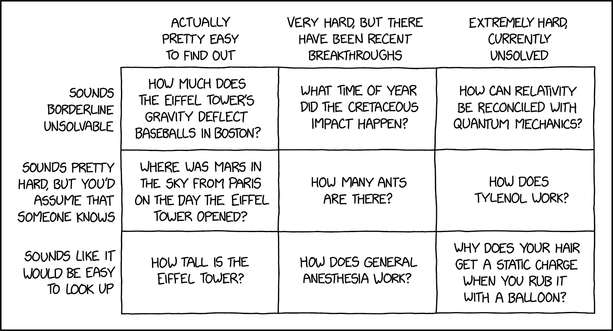
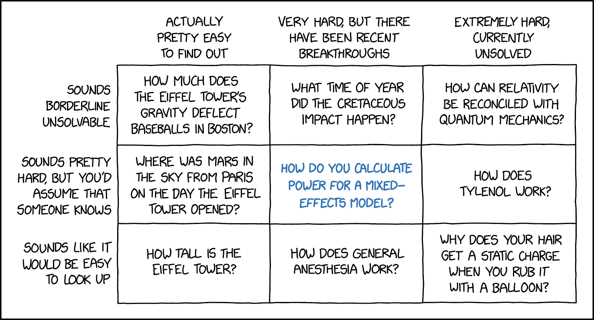
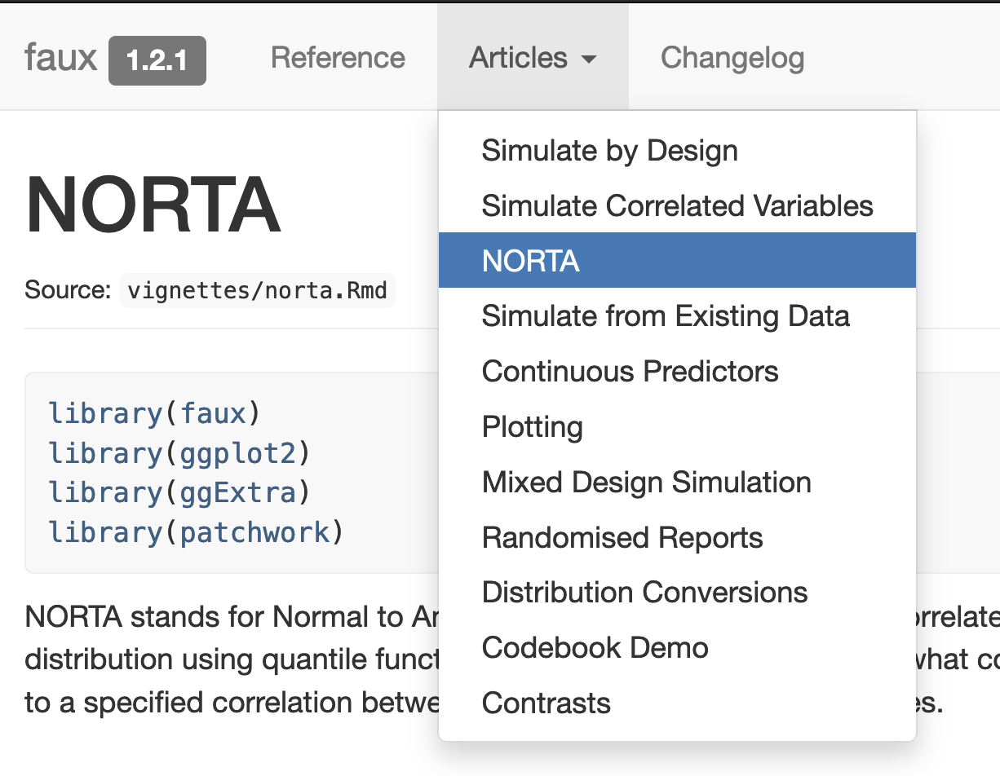

```{r, include=FALSE}
url <- "https://scienceverse.org/talks/2026-power-sim/"
subtitle <- sprintf("[%s](%s)", url, url)
# make QR code
qrcode::qr_code(url) |> qrcode::generate_svg("images/qrcode.svg")
```
---
title: "Power and Simulation"
subtitle: "Lisa DeBruine, Cristian Mesquida, Daniël Lakens"
author: "{width=300}
\n\n`r subtitle`
\n\n<https://github.com/scienceverse/talks>"
format: 
  revealjs:
    logo: images/scienceverse.png
    theme: [dark, style.scss]
    transition: none
    transition-speed: fast
    syntax-highlighting: zenburn
---

# Abstract

```{r, include = FALSE}
library(tidyverse)
library(flextable)
library(afex)
library(faux)

knitr::opts_chunk$set(echo = FALSE)

set_flextable_defaults(font.size = 20, padding.top = )
theme_set(theme_minimal(base_size = 17))
faux_options(plot = FALSE)
set.seed(8675309)
```

Power analyses help us to plan studies and interpret findings. The statistical power of a specific test depends on the effect size, sample size, and alpha criterion. In this talk, I will cover common mistakes with conducting and reporting power analyses, and present simulation-based methods for conducting power analyses for any inferential test. I will cover fixed effects and mixed effects models, with additional materials at <https://debruine.github.io/data-sim-workshops/>.


# Power

::: {style="font-size: 90%;"}
* **false positive rate**: the probability a <i class="st">test</i> concludes there is an <i class="es">effect</i> when there is no effect; Type I Error Rate
* **<i class="a">alpha</i> **: the false positive rate we accept for a <i class="st">test</i>
* **false negative rate**: the probability a <i class="st">test</i> concludes there is no <i class="es">effect</i> when there is one; Type II Error Rate
* **beta**: the false negative rate we accept for a test
* **true positive rate**: the probability a <i class="st">test</i> concludes there is an <i class="es">effect</i> when there is one
* **<i class="power">power</i>**: the true positive rate (1-beta), given a <i class="st">test</i>, <i class="es">effect</i>, <i class="ss">sample size</i>, and <i class="a">alpha</i> 
:::


## Types of Power Analysis

:::: {.columns}

::: {.column width="80%"}

* <i class="pt">**A Priori**</i>:  calculates the <i class="ss">sample size</i> required to achieved a pre-specified <i class="power">power</i> for a pre-specified <i class="es">effect size</i>

* <i class="pt">**Sensitivity (Effect Size)**</i>: calculates the smallest <i class="es">effect size</i> required to detect a pre-specified <i class="ss">sample size</i> with a pre-specified <i class="power">power</i> 

* <i class="pt">**Sensitivity (Power)**</i>: calculates <i class="power">power</i> given a pre-specified <i class="es">effect size</i> and <i class="ss">sample size</i>

* <i class="pt">**Post Hoc**</i>: calculates the <i class="power">power</i> associated with the observed <i class="es">effect size</i> and the <i class="ss">sample size</i> actually obtained

:::

::: {.column width="20%"}


:::

::::

## Reporting

* <i class="pt">power type</i>: a priori, power/sample size sensitivity, post hoc
* <i class="power">power</i>: 0-100%
* <i class="ss">sample size</i>: number of subjects/items
* <i class="es">effect size</i>: numeric value
* <i class="esm">effect size metric</i>: e.g., Cohen's d, r, $\eta_{p}^{2}$, raw
* <i class="st">statistical test</i>: full specification
* <i class="a">alpha</i>: 0-1, often assumed to be 0.05
* <i class="sw">software</i>: e.g., G*Power, Superpower, simulation!

## 

How would you write up this power analysis?

```{r}
#| echo: true

pwr::pwr.t.test(          
  power = 0.80,           
  d = 0.5,                
  sig.level = 0.01,       
  type = "two.sample",    
  alternative = "greater" 
)
```

## Model Reporting Example

> We conducted an <i class="pt">a priori analysis</i> to determine the sample size with <i class="power">80%</i> power to detect the smallest effect size of interest (SESOI), which was a <i class="esm">Cohen's d</i> of <i class="es">0.5</i> determined by a cost-benefit analysis of the intervention. We used the <i class="sw">pwr package (Champely, 2020)</i> for an <i class="st">independent samples t-test, assuming equal variance and using a one-tailed prediction</i>, with a critical alpha of <i class="a">0.01</i>. This determined that we would need <i class="ss">82</i> subjects in each group. 

## The Reality

> A sample size of <i class="ss">22</i> participants was predetermined to yield a power of <i class="power">80%</i> and to detect an effect of comparable size to previous studies using similar independent and dependent measures (CITE).

## The Reality

> A <i class="sw">G*Power (Version 3.1; Faul et al., 2009)</i> analysis using pilot data from 20 participants for a <i class="a">Bonferroni-corrected (for two comparisons)</i> <i class="st">one-sample t test</i> (<i class="esm">d</i> = <i class="es">0.45</i>, α = .05, p = .95) determined that we should recruit <i class="ss">67</i> participants.


## The Reality

> We decided to obtain a sample size that would allow us to detect a within-subjects difference of at least a medium effect size (<i class="esm">Cohen's d</i> > <i class="es">0.5</i>) with <i class="power">80%</i> power, using a <i class="st">two-tailed t-test</i>. A power analysis using <i class="sw">G*Power (Version 3.1.9.3; Faul et al., 2007)</i> indicated that this required a sample size of <i class="ss">34</i>.

## We Could Do Better {.smaller}

Only 11% of 1295 power analyses from 1937 *Psychological Science* papers published between 2014 and 2026 have complete reporting.

| Component | Percent Missing[^pwrpaper] |
|:--------------------|--:|
| <i class="pt">power type</i>          |  0% |
| <i class="power">power</i>            | 15% |
| <i class="ss">sample size</i>         | 19% |
| <i class="es">effect size</i>         | 32% |
| <i class="esm">effect size metric</i> | 28% |
| <i class="st">statistical test</i>    | 22% |
| <i class="a">alpha</i>                | 67% |
| <i class="sw">software</i>            | 71% |

[^pwrpaper]: Preliminary analysis using [Metacheck](https://scienceverse.github.io/metacheck), from Mesquida, Lakens & DeBruine (in prep)

# Power Simulation

How do you calculate power for a design where we think we will only be able to recruit twice as many younger people as older people, and expect the older subjects to have a lower score with more variance?

## Simulate Data Sets

```{r}
#| echo: true

sim_data_func <- function(n, rep = 100) {
  faux::sim_design(
    between = list(age_group = c("young", "old")),
    n = c(2*n, n),
    mu = c(100, 90),
    sd = c(20, 25),
    dv = "score",
    long = TRUE,
    rep = rep
  )
}

sim_data <- sim_data_func(n = 30)
```

```{r}
sim_data$data[[1]] |>
  mutate(rep = 1) |>
  bind_rows(sim_data$data[[2]] |> mutate(rep = 2)) |>
  
  summarise(n = n(),
            mean = mean(score), 
            sd = sd(score), 
            .by = c(rep, age_group)) |>
  flextable() |>
  colformat_double(j = 4:5, digits = 1) |>
  theme_vader()
```


## Analysis Function

```{r}
#| echo: true

analysis_func <- function(data) {
  tt <- t.test(score ~ age_group, data = data, 
               alternative = "greater", 
               var.equal = FALSE)
  broom::tidy(tt)[, 1:8]
}
```

Test on the first data set

```{r}
#| echo: true
#| eval: false

analysis_func(sim_data$data[[1]])
```

::: {style="font-size: 90%;"}
```{r}
analysis_func(sim_data$data[[1]]) |>
  flextable() |>
  colformat_double(digits = 1) |>
  colformat_double(j = c("p.value"), digits = 3) |>
  theme_vader()
```
:::

## Power Sensitivity

```{r}
#| echo: true
sim_results <- sim_data |>
  mutate(analysis = purrr::map(data, analysis_func)) |>
  select(-data) |>
  unnest(analysis)

power <- mean(sim_results$p.value < .05)
```

```{r}
ggplot(sim_results, aes(x = estimate, fill = p.value < .05)) +
  geom_histogram(binwidth = 1, color = "black") +
  labs(title = sprintf("Power = %d%%", power*100),
       y = "Number of simulations", 
       x = "Mean Score Difference (young - old)") +
  scale_fill_manual(values = c("grey", "dodgerblue")) +
  scale_y_continuous(breaks = seq(0, 20, 2)) +
  theme(legend.position = "inside",
        legend.position.inside = c(0.2, .8))
```

## A Priori

Iterate the process above over a sequence of possible Ns. 

```{r}
#| echo: false
pwr <- data.frame(n = seq(20, 100, by = 5)) |>
  rowwise() |>
  mutate(power = {
    p <- sim_data_func(n) |>
      mutate(analysis = purrr::map(data, analysis_func)) |>
      select(-data) |>
      unnest(analysis) |>
      summarise(power = mean(p.value < .05))
    p$power
  })
```

```{r}
ggplot(pwr, aes(x = n, y = power)) +
  labs(x = "N for Older Group", y = "Power from 100 Simulations") +
  geom_hline(yintercept = 0.8, color = "red") +
  geom_smooth(method = "loess", formula = y~x, se = FALSE) +
  geom_point()
```

## A Priori

Decrease the range and increase the density of sampling and number of replications to get a more accurate estimate. 

```{r}
pwr <- data.frame(n = seq(45, 60, by = 1)) |>
  rowwise() |>
  mutate(power = {
    p <- sim_data_func(n, rep = 250) |>
      mutate(analysis = purrr::map(data, analysis_func)) |>
      select(-data) |>
      unnest(analysis) |>
      summarise(power = mean(p.value < .05))
    p$power
  })

ggplot(pwr, aes(x = n, y = power)) +
  labs(x = "N for Older Group", y = "Power from 250 Simulations") +
  geom_hline(yintercept = 0.8, color = "red") +
  geom_smooth(method = "lm", formula = y~x, se = FALSE) +
  geom_point() +
  scale_x_continuous(minor_breaks = 45:60)
```

## Write Up

We conducted an <i class="pt">a priori analysis</i> to determine the sample size with <i class="power">80%</i> power to detect the smallest effect size of interest (SESOI), which was a <i class="es">10</i>-<i class="esm">point raw difference in score</i> between younger and older subjects, where <i class="st">younger subjects had an SD of 20 and older subject had an SD of 25</i>. We used a custom <i class="sw">data simulation script in R (see shared code)</i> with <i class="sw">250 replications</i> for a <i class="st">Welch two-sample t-test using a one-tailed prediction</i>, with a critical alpha of <i class="a">0.05</i>. This determined that we would need approximately <i class="ss">51</i> subjects in the older group and <i class="ss">102</i> subjects in the younger group. 

# Mixed Effects



# Mixed Effects



## Faux

:::: {.columns}

::: {.column width="50%"}


[Shiny app or scriptable](https://debruine.github.io/faux/)

:::

::: {.column width="50%"}



[Extensive Documentation](https://debruine.github.io/faux/)

:::
::::

## Simulate a Crossed Design

 * 100 subjects
 * 20 items
 * two conditions: control and experimental
 * dependent variable = reaction time in ms
 * SESOI = 10 ms 
 * *variability between subjects and between items in average RT and the effect of condition*


## Random factors

Start with a small number of subjects to more easily view the resulting table.

```{r, echo = TRUE}
subj_n <- 2 # number of subjects

lmem_dat <- add_random(subj = subj_n)
```

```{r}
lmem_dat |>
  flextable() |>
  theme_vader()
```


## Crossed random factors

Cross subjects with a small number of items.

```{r, echo = TRUE}
item_n <- 2 # number of items

lmem_dat <- add_random(subj = subj_n) |>
  add_random(item = item_n)
```

```{r}
(lmem_dat) |>
  flextable() |>
  theme_vader()
```

## Nested random factors

You can also nest items in faux (but this is not our design).

```{r, echo = TRUE}
lmem_dat <- add_random(subj = subj_n) |>
  add_random(item = item_n, .nested_in = "subj")
```

```{r}
lmem_dat |>
  flextable() |>
  theme_vader()
```

## Fixed factors (between)

You can set fixed factors that vary between subject or items (but this is not our design).

```{r, echo = TRUE}
lmem_dat <- add_random(subj = subj_n) |>
  add_random(item = item_n) |>
  add_between(condition = c("control", "experimental"), .by = "item")
```

```{r}
lmem_dat |>
  flextable() |>
  theme_vader()
```

## Fixed factors (within)

Here, we set a factor that varies within subjects and items.

```{r, echo = TRUE}
lmem_dat <- add_random(subj = subj_n) |>
  add_random(item = item_n) |>
  add_within(condition = c("control", "experimental"))
```

```{r}
lmem_dat |>
  flextable() |>
  theme_vader()
```


## Contrast Coding

::: {style="font-size: 50%;"}
| My name | Other names | R | Julia | faux |
|:--------|:------------|:-----------|:-----------|:--------------|
| Treatment | Treatment ([2](https://talklab.psy.gla.ac.uk/tvw/catpred/#what-are-the-key-coding-schemes)), Dummy ([1](https://marissabarlaz.github.io/portfolio/contrastcoding/#dummy-coding), [4](https://stats.oarc.ucla.edu/r/library/r-library-contrast-coding-systems-for-categorical-variables/#dummy), [6](https://phillipalday.com/stats/coding.html#simple-regression-dummy-coding)), Simple ([5](https://gamlj.github.io/rosetta_contrasts.html#Contrast:_Simple__Dummy)) | `contr.treatment` | [`DummyCoding`](https://repsychling.github.io/SMLP2026/contrasts/contrasts_kwdyz11.html#dummy-coding) | `contr_code_treatment` |
| Anova | Deviation ([2](https://talklab.psy.gla.ac.uk/tvw/catpred/#what-are-the-key-coding-schemes)), Contrast ([1](https://marissabarlaz.github.io/portfolio/contrastcoding/#contrast-coding)), Simple ([4](https://stats.oarc.ucla.edu/r/library/r-library-contrast-coding-systems-for-categorical-variables/#SIMPLE)) | `contr.treatment - 1/k` | [`HypothesisCoding`](https://repsychling.github.io/SMLP2026/contrasts/contrasts_kwdyz11.html#anova-coding) | `contr_code_anova` |
| Sum| Sum ([1](https://marissabarlaz.github.io/portfolio/contrastcoding/#sum-coding), [2](https://talklab.psy.gla.ac.uk/tvw/catpred/#what-are-the-key-coding-schemes), [6](https://phillipalday.com/stats/coding.html#simple-regression-sum-coding)), Effects ([3](https://doi.org/10.6339/JDS.2010.08(1).563)), Deviation ([4](https://stats.oarc.ucla.edu/r/library/r-library-contrast-coding-systems-for-categorical-variables/#SIMPLE), [5](https://gamlj.github.io/rosetta_contrasts.html#Contrast:_Deviation)), Unweighted Effects ([7](https://doi.org/10.1111/j.1467-6494.1996.tb00813.x)) | `contr.sum` | [`EffectsCoding`](https://repsychling.github.io/SMLP2026/contrasts/contrasts_kwdyz11.html#effects-coding) | `contr_code_sum` |
| Difference | Contrast ([3](https://doi.org/10.6339/JDS.2010.08(1).563)), Forward/Backward ([4](https://stats.oarc.ucla.edu/r/library/r-library-contrast-coding-systems-for-categorical-variables/#forward)), Repeated ([5](https://gamlj.github.io/rosetta_contrasts.html#Contrast:_Repeated)) | `MASS::contr.sdif` | [`SeqDiffCoding`](https://repsychling.github.io/SMLP2026/contrasts/contrasts_kwdyz11.html#sequential-difference-coding) | `contr_code_difference` |
| Helmert | Reverse Helmert ([1](https://marissabarlaz.github.io/portfolio/contrastcoding/#reverse-helmert-coding), [4](https://stats.oarc.ucla.edu/r/library/r-library-contrast-coding-systems-for-categorical-variables/#reverse)), Difference ([5](https://gamlj.github.io/rosetta_contrasts.html#Contrast:_Difference)), Contrast ([7](https://doi.org/10.1111/j.1467-6494.1996.tb00813.x)) | `contr.helmert / (column_i+1)` | [`HelmertCoding`](https://repsychling.github.io/SMLP2026/contrasts/contrasts_kwdyz11.html#helmert-coding) | `contr_code_helmert` |
| Polynomial | Polynomial ([5](https://gamlj.github.io/rosetta_contrasts.html#Contrast:_Polynomial)), Orthogonal Polynomial ([4](https://stats.oarc.ucla.edu/r/library/r-library-contrast-coding-systems-for-categorical-variables/#ORTHOGONAL)), Trend ([3](https://doi.org/10.6339/JDS.2010.08(1).563)) | `contr.poly` | `HypothesisCoding` | `contr_code_poly` |

:::

[Faux Explainer](https://debruine.github.io/faux/articles/contrasts.html) | [RePsychLing Explainer](https://repsychling.github.io/SMLP2026/contrasts/contrasts_kwdyz11.html)

## Codings

```{r, echo = TRUE}
lmem_dat <- add_random(subj = subj_n) |>
  add_random(item = item_n) |>
  add_within(condition = c("control", "experimental")) |>
  add_contrast("condition", "treatment", colnames = "treat") |>
  add_contrast("condition", "anova", colnames = "anova") |>
  add_contrast("condition", "sum", colnames = "sum")
  
```

```{r}
lmem_dat |>
  flextable() |>
  theme_vader()
```


## Design

```{r, echo = TRUE}
# define this to make room later

design <- add_random(subj = subj_n) |>
  add_random(item = item_n) |>
  add_within(condition = c("control", "experimental")) |>
  add_contrast("condition", "treatment", colnames = "cond")
```

```{r}
design |>
  flextable() |>
  theme_vader()
```

## Fixed Effects

```{r, echo = TRUE}
intercept <- 600 # model intercept (mean for control condition)
cond_eff  <-  10 # condition effect size

lmem_dat <- design |>
  mutate(dv = intercept + 
           cond * cond_eff)
```

```{r}
lmem_dat |>
  flextable() |>
  theme_vader()
```

## Error Term

```{r, echo = TRUE}
error_sd <- 20 # SD of trial-level error (residuals)

lmem_dat <- design |>
  add_ranef(err = error_sd) |>
  mutate(dv = intercept + err +
           cond * cond_eff)
```

```{r}
lmem_dat |>
  flextable() |>
  colformat_double(j = c("err", "dv"), digits = 2) |>
  theme_vader()
```

## Random Intercepts

```{r, echo = TRUE}
subj_sd      <-   8 # SD of subject-level intercepts
item_sd      <-   4 # SD of item-level intercepts

lmem_dat <- design |>
  add_ranef(err = error_sd) |>
  add_ranef(.by = "subj", subj_i = subj_sd) |>
  add_ranef(.by = "item", item_i = item_sd) |>
  mutate(dv = intercept + subj_i + item_i + err +
           cond * cond_eff)
```

```{r}
lmem_dat |>
  flextable() |>
  colformat_double(j = c("err", "subj_i", "item_i", "dv"), digits = 2) |>
  theme_vader()
```

## Random Slopes

```{r, echo = TRUE}
subj_cond_sd <-   5 # SD of subject-level condition effect size
item_cond_sd <-  15 # SD of item-level condition effect size
subj_cors    <-   0.5 # correlation between subject intercept and slope
item_cors    <-  -0.5 # correlation between item intercept and slope

lmem_dat <- design |>
  add_ranef(err = error_sd) |>
  add_ranef(.by = "subj", 
            subj_i = subj_sd, 
            subj_cond = subj_cond_sd, 
            .cors = subj_cors) |>
  add_ranef(.by = "item", 
            item_i = item_sd, 
            item_cond = item_cond_sd, 
            .cors = item_cors) |>
  mutate(dv = intercept + subj_i + item_i + err +
           cond * (cond_eff + subj_cond + item_cond))
```

## Random Slopes

```{r}
lmem_dat |>
  flextable() |>
  colformat_double(j = c("err", "subj_i", "subj_cond", "item_i", "item_cond", "dv"), digits = 2) |>
  theme_vader() |>
  fontsize(size = 18, part = "all")
```

## Parameters

```{r, echo = TRUE}
subj_n       <- 100   # number of subjects
item_n       <-  20   # number of items
intercept    <- 600   # model intercept (mean for control condition)
cond_eff     <-  10   # condition effect size
error_sd     <-  20   # SD of trial-level error (residuals)
subj_sd      <-   8   # SD of subject-level intercepts
item_sd      <-   4   # SD of item-level intercepts
subj_cond_sd <-   5   # SD of subject-level condition effect size
item_cond_sd <-  15   # SD of item-level condition effect size
subj_cors    <-   0.5 # correlation between subject intercept and slope
item_cors    <-  -0.5 # correlation between item intercept and slope
```

## Full Data Simulation Code

```{r, echo = TRUE}
lmem_dat <- add_random(subj = subj_n) |>
  add_random(item = item_n) |>
  add_within(condition = c("control", "experimental")) |>
  add_contrast("condition", "treatment", colnames = "cond") |>
  add_ranef(err = error_sd) |>
  add_ranef(.by = "subj", 
            subj_i = subj_sd, 
            subj_cond = subj_cond_sd, 
            .cors = subj_cors) |>
  add_ranef(.by = "item", 
            item_i = item_sd, 
            item_cond = item_cond_sd, 
            .cors = item_cors) |>
  mutate(dv = intercept + subj_i + item_i + err +
           cond * (cond_eff + subj_cond + item_cond))
```

## LMEM Analysis

```{r, echo = TRUE}
lmer(dv ~ cond + 
       (1 + cond | subj) + 
       (1 + cond | item),
     data = lmem_dat) |> summary()
```

## Power simulation

1. Wrap dataset creation and analysis in a function that returns the values you care about as a data frame
2. Iterate this function and save the output as a data frame
3. Summarise the output (e.g., power, range of effect sizes)

## Function Outline

```{r, echo = TRUE, eval = FALSE}

sim_func <- function(iteration = 0, subj_n = 100, item_n = 20, cond_eff = 0) {
  # variables not in function arguments

  # simulate the data
  lmem_dat <- ...
  
  # run the analysis
  mod <- lmer(...)
  
  # return a table of fixed effects only
  broom.mixed::tidy(mod, effects = "fixed") |>
    mutate(iteration = iteration)
}

```


## Full Function

```{r, echo = TRUE}
sim_func <- function(iteration = 0, subj_n = 100, item_n = 20, cond_eff = 0) {
  # variables not in function arguments
  intercept    <- 600
  error_sd     <-  20
  subj_sd      <-   8
  item_sd      <-   4
  subj_cond_sd <-   5
  item_cond_sd <-  15
  subj_cors    <-   0.5
  item_cors    <-  -0.5

  # simulate the data
  lmem_dat <- add_random(subj = subj_n) |>
    add_random(item = item_n) |>
    add_within(condition = c("control", "experimental")) |>
    add_contrast("condition", "treatment", colnames = "cond") |>
    add_ranef(err = error_sd) |>
    add_ranef(.by = "subj", 
              subj_i = subj_sd, 
              subj_cond = subj_cond_sd, 
              .cors = subj_cors) |>
    add_ranef(.by = "item", 
              item_i = item_sd, 
              item_cond = item_cond_sd, 
              .cors = item_cors) |>
    mutate(dv = intercept + subj_i + item_i + err +
             cond * (cond_eff + subj_cond + item_cond))
  
  # run the analysis
  mod <- lmer(dv ~ cond + 
       (1 + cond | subj) + 
       (1 + cond | item),
     data = lmem_dat)
  
  # return a table of fixed effects only
  broom.mixed::tidy(mod, effects = "fixed") |>
    mutate(iteration = iteration)
}

```

## Test the Function

``` r
sim_func()
```

```{r}
sim_func() |>
  select(-iteration) |>
  flextable() |>
  colformat_double(digits = 2) |>
  theme_vader()
```

``` r
# again to make sure iterations differ
sim_func()
```

```{r}
sim_func() |>
  select(-iteration) |>
  flextable() |>
  colformat_double(digits = 2) |>
  theme_vader()
```

``` r
# change effect size
sim_func(cond_eff = 10)
```

```{r}
sim_func(cond_eff = 10) |>
  select(-iteration) |>
  flextable() |>
  colformat_double(digits = 2) |>
  theme_vader()
```

## Iterate

```{r, echo = TRUE}
set.seed(8675309)

sim_results <- map_df(1:10, sim_func, cond_eff = 10)
```

```{r}
head(sim_results, 10) |>
  flextable() |>
  colformat_double(digits = 2) |>
  colformat_double(j = "iteration", digits = 0) |>
  theme_vader()
```

## Summarise

```{r, echo = TRUE, eval = FALSE}

alpha <- 0.05 # critical alpha

sim_results |>
  summarise(power = mean(p.value < alpha), .by = term)
```

```{r}
alpha <- 0.05
power_table <- sim_results |>
  summarise(power = mean(p.value < alpha), .by = term) 

power_table |>
  flextable() |>
  theme_vader()
```


## Change Parameters

Try increasing the SD for subject and item intercepts and slopes by 20%.

```{r, echo = TRUE, eval=FALSE}
sim_func2 <- function(iteration = 0, subj_n = 100, item_n = 20, cond_eff = 0) {
  # variables not in function arguments
  intercept    <- 600
  error_sd     <-  20
  subj_sd      <-   8 * 1.2
  item_sd      <-   4 * 1.2
  subj_cond_sd <-   5 * 1.2
  item_cond_sd <-  15 * 1.2
  subj_cors    <-   0.5
  item_cors    <-  -0.5

  # continue the function as before...
}
```

```{r}

sim_func2 <- function(iteration = 0, subj_n = 100, item_n = 20, cond_eff = 0) {
  # variables not in function arguments
  intercept    <- 600
  error_sd     <-  20
  subj_sd      <-   8 * 1.2
  item_sd      <-   4 * 1.2
  subj_cond_sd <-   5 * 1.2
  item_cond_sd <-  15 * 1.2
  subj_cors    <-   0.5
  item_cors    <-  -0.5

  # simulate the data
  lmem_dat <- add_random(subj = subj_n) |>
    add_random(item = item_n) |>
    add_within(condition = c("control", "experimental")) |>
    add_contrast("condition", "treatment", colnames = "cond") |>
    add_ranef(err = error_sd) |>
    add_ranef(.by = "subj", 
              subj_i = subj_sd, 
              subj_cond = subj_cond_sd, 
              .cors = subj_cors) |>
    add_ranef(.by = "item", 
              item_i = item_sd, 
              item_cond = item_cond_sd, 
              .cors = item_cors) |>
    mutate(dv = intercept + subj_i + item_i + err +
             cond * (cond_eff + subj_cond + item_cond))
  
  # run the analysis
  mod <- lmer(dv ~ cond + 
       (1 + cond | subj) + 
       (1 + cond | item),
     data = lmem_dat)
  
  # return a table of fixed effects only
  broom.mixed::tidy(mod, effects = "fixed") |>
    mutate(iteration = iteration)
}

set.seed(8675309)

sim_results2 <- map_df(1:10, sim_func2, cond_eff = 10)

alpha <- 0.05
power_table2 <- sim_results2 |>
  summarise(power = mean(p.value < alpha), .by = term) 

power_table2 |>
  flextable() |>
  theme_vader()
```


## Write Up {.smaller}

We conducted a <i class="pt">sensitivity power analysis</i> using <i class="sw">custom simulation code and the R packages faux (DeBruine, 2026) and lme4 (Bates, Maechler, Bolker & Walker, 2015)</i> to determine the power. With <i class="ss">100 subjects and 20 items</i>, an effect of condition of <i class="es">10</i> <i class="esm">milliseconds</i>, using <i class="st">treatment coding (control = 0, experimental = 1)</i>, the <i class="st">expected parameters in @tbl-model-params</i>, and a <i class="a">critical alpha of 0.05</i>, simulation using <i class="sw">10 replications</i> resulted in a power of <i class="power">`r power_table$power[[2]]*100`%</i>.


| Model Parameter                    | Value |
|:--------------------------------------|------:|
| SD of trial-level error (residuals)          |  20   |
| SD of subject-level intercepts               |   8   |
| SD of item-level intercepts                  |   4   |
| SD of subject-level condition effect         |   5   |
| SD of item-level condition effect            |  15   |
| Correlation between subject-level intercept and condition effect |   0.5 |
| Correlation between item-level intercept and condition effect    |  -0.5 |

: Model parameters for simulation were guessed at random {#tbl-model-params}

# Further Resources

:::{layout-nrow=1}

[](https://simsummerschool.github.io/)

[](https://debruine.github.io/data-sim-workshops/)

:::

# Thank You! {.center}


<`r url`>
